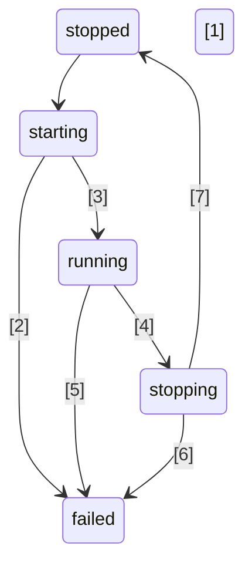

[](https://www.npmjs.com/package/@kronos-integration/service)
[](https://spdx.org/licenses/0BSD.html)
[](https://typescriptlang.org)
[](https://bundlejs.com/?q=@kronos-integration/service)
[](https://npmjs.org/package/@kronos-integration/service)
[](https://github.com/Kronos-Integration/service/issues)
[](https://actions-badge.atrox.dev/Kronos-Integration/service/goto)
[](https://github.com/prettier/prettier)
[](http://commitizen.github.io/cz-cli/)
[](https://snyk.io/test/github/Kronos-Integration/service)

# @kronos-integration/service

Base service implementation

# Service states



The transitions are:
| Number | From | To | Condition |
| ------ | ---- | -- | --------- |
| 1 | `~stopped~` | `~starting~` | |
| 2 | `~starting~` | `~failed~` | |
| 3 | `~starting~` | `~running~` | |
| 4 | `~running~` | `~stopping~` | |
| 5 | `~running~` | `~failed~` | |
| 6 | `~stopping~` | `~failed~` | |
| 7 | `~stopping~` | `~stopped~` | |

# API

<!-- Generated by documentation.js. Update this documentation by updating the source code. -->

### Table of Contents

*   [EndpointsMixin](#endpointsmixin)
    *   [Parameters](#parameters)
*   [endpoints](#endpoints)
*   [ServiceConfig](#serviceconfig)
    *   [Properties](#properties)
    *   [configFor](#configfor)
        *   [Parameters](#parameters-1)
    *   [clearPreserved](#clearpreserved)
        *   [Parameters](#parameters-2)
    *   [configureValue](#configurevalue)
        *   [Parameters](#parameters-3)
    *   [configure](#configure)
        *   [Parameters](#parameters-4)
    *   [autostart](#autostart)
    *   [name](#name)
*   [merge](#merge)
    *   [Parameters](#parameters-5)
*   [defineServiceConsumerProperties](#defineserviceconsumerproperties)
    *   [Parameters](#parameters-6)
*   [ServiceLogger](#servicelogger)
    *   [autostart](#autostart-1)
    *   [name](#name-1)
    *   [endpoints](#endpoints-1)
*   [Service](#service)
    *   [Parameters](#parameters-7)
    *   [Properties](#properties-1)
    *   [extendetName](#extendetname)
    *   [stateChanged](#statechanged)
        *   [Parameters](#parameters-8)
    *   [rejectWrongState](#rejectwrongstate)
        *   [Parameters](#parameters-9)
    *   [timeoutForTransition](#timeoutfortransition)
        *   [Parameters](#parameters-10)
    *   [\_start](#_start)
    *   [\_stop](#_stop)
    *   [\_restart](#_restart)
    *   [restartIfRunning](#restartifrunning)
    *   [toStringAttributes](#tostringattributes)
    *   [isServiceProvider](#isserviceprovider)
    *   [toString](#tostring)
    *   [toJSONWithOptions](#tojsonwithoptions)
        *   [Parameters](#parameters-11)
    *   [name](#name-2)
    *   [autostart](#autostart-2)
    *   [\_configure](#_configure)
        *   [Parameters](#parameters-12)
    *   [configure](#configure-1)
        *   [Parameters](#parameters-13)
    *   [getCredential](#getcredential)
        *   [Parameters](#parameters-14)
    *   [getCredentials](#getcredentials)
        *   [Parameters](#parameters-15)
    *   [log](#log)
        *   [Parameters](#parameters-16)
    *   [attributes](#attributes)
    *   [endpoints](#endpoints-2)
*   [StandaloneServiceProvider](#standaloneserviceprovider)
    *   [name](#name-3)

## EndpointsMixin

Endpoint accessor mixin.
Manages endpoints in a container.

### Parameters

*   `superclass` &#x20;

## endpoints

Default set of endpoints to create.

Returns **[Object](https://developer.mozilla.org/docs/Web/JavaScript/Reference/Global_Objects/Object)** {} empty set

## ServiceConfig

**Extends Service**

Config providing service.
Dispatches config requests to services.
Also preserves them until a maching service becomes avaliable.

### Properties

*   `preservedConfigs` **[Map](https://developer.mozilla.org/docs/Web/JavaScript/Reference/Global_Objects/Map)<[string](https://developer.mozilla.org/docs/Web/JavaScript/Reference/Global_Objects/String), [Object](https://developer.mozilla.org/docs/Web/JavaScript/Reference/Global_Objects/Object)>** values for services not already established

### configFor

Deliver configuration for a given service.

#### Parameters

*   `name` **[string](https://developer.mozilla.org/docs/Web/JavaScript/Reference/Global_Objects/String)** service name
*   `config` **[Object](https://developer.mozilla.org/docs/Web/JavaScript/Reference/Global_Objects/Object)**&#x20;

### clearPreserved

Forget about preserved config of a service.

#### Parameters

*   `name` **[string](https://developer.mozilla.org/docs/Web/JavaScript/Reference/Global_Objects/String)** service name

### configureValue

Set config entry.

#### Parameters

*   `key` **[string](https://developer.mozilla.org/docs/Web/JavaScript/Reference/Global_Objects/String)** path to the value
*   `value` **any**&#x20;

### configure

#### Parameters

*   `config` **([Array](https://developer.mozilla.org/docs/Web/JavaScript/Reference/Global_Objects/Array) | [Object](https://developer.mozilla.org/docs/Web/JavaScript/Reference/Global_Objects/Object))**&#x20;

### autostart

We always start immediate.

Returns **[boolean](https://developer.mozilla.org/docs/Web/JavaScript/Reference/Global_Objects/Boolean)** true

### name

Returns **[string](https://developer.mozilla.org/docs/Web/JavaScript/Reference/Global_Objects/String)** 'config'

## merge

Merge from b into a.
When *a* and *b* are arrays of values only the none duplicates are appendend to *a*.

### Parameters

*   `a` **any**&#x20;
*   `b` **any**&#x20;

Returns **any** merged b into a

## defineServiceConsumerProperties

Assign services based on a configuration.

### Parameters

*   `target` **[Object](https://developer.mozilla.org/docs/Web/JavaScript/Reference/Global_Objects/Object)** object
*   `config` **[Object](https://developer.mozilla.org/docs/Web/JavaScript/Reference/Global_Objects/Object)** service defintion
*   `provider` **[Object](https://developer.mozilla.org/docs/Web/JavaScript/Reference/Global_Objects/Object)** service provider
*   `waitUntilFactoryPresent` **[boolean](https://developer.mozilla.org/docs/Web/JavaScript/Reference/Global_Objects/Boolean)**&#x20;

## ServiceLogger

**Extends Service**

Log receiving service.

### autostart

We always start immediate.

Returns **[boolean](https://developer.mozilla.org/docs/Web/JavaScript/Reference/Global_Objects/Boolean)** true

### name

Returns **[string](https://developer.mozilla.org/docs/Web/JavaScript/Reference/Global_Objects/String)** 'logger'

### endpoints

Adds a log input endpoint to the set of Service endpoints.

Returns **[Object](https://developer.mozilla.org/docs/Web/JavaScript/Reference/Global_Objects/Object)** predefined endpoints

## Service

**Extends EndpointsMixin(StateTransitionMixin(LogLevelMixin(class {}), prepareActions({
&#x20; start: {
&#x20;   stopped: rsfDefault
&#x20; },
&#x20; restart: {
&#x20;   stopped: rsfDefault,
&#x20;   running: {
&#x20;     target: "running",
&#x20;     during: "restarting",
&#x20;     timeout
&#x20;   }
&#x20; },
&#x20; stop: {
&#x20;   running: ssfDefault,
&#x20;   starting: ssfDefault,
&#x20;   failed: ssfDefault
&#x20; }
}), "stopped"))**

Service
The initial state is 'stopped'.
All services have at least three endpoints:

*   log *out*: log events
*   config *in*: configuration request
*   command *in*: administrative actions to be executed by the step

### Parameters

*   `config` **[Object](https://developer.mozilla.org/docs/Web/JavaScript/Reference/Global_Objects/Object)**&#x20;

    *   `config.name` **[string](https://developer.mozilla.org/docs/Web/JavaScript/Reference/Global_Objects/String)**&#x20;
    *   `config.logLevel` **[string](https://developer.mozilla.org/docs/Web/JavaScript/Reference/Global_Objects/String)**&#x20;
    *   `config.autostart` **[boolean](https://developer.mozilla.org/docs/Web/JavaScript/Reference/Global_Objects/Boolean)** defaults to false
    *   `config.description` **[string](https://developer.mozilla.org/docs/Web/JavaScript/Reference/Global_Objects/String)** human readable description
    *   `config.endpoints` **[Object](https://developer.mozilla.org/docs/Web/JavaScript/Reference/Global_Objects/Object)** will be merged with the build in ones
*   `ic` **InitializationContext**&#x20;

### Properties

*   `endpoints` **[Object](https://developer.mozilla.org/docs/Web/JavaScript/Reference/Global_Objects/Object)**&#x20;

### extendetName

Used in human readable state messages.
Besides the actual service name it may contain additional short hints.

Returns **[string](https://developer.mozilla.org/docs/Web/JavaScript/Reference/Global_Objects/String)**&#x20;

### stateChanged

Called when the service state changes.
Emits a serviceStateChanged event to the owner.

#### Parameters

*   `origin` &#x20;
*   `oldState` **[string](https://developer.mozilla.org/docs/Web/JavaScript/Reference/Global_Objects/String)**&#x20;
*   `newState` **[string](https://developer.mozilla.org/docs/Web/JavaScript/Reference/Global_Objects/String)**&#x20;

### rejectWrongState

Called when state transition is not allowed.

#### Parameters

*   `action` **[string](https://developer.mozilla.org/docs/Web/JavaScript/Reference/Global_Objects/String)** originating action name

<!---->

*   Throws **any** always

### timeoutForTransition

Deliver transition timeout.

#### Parameters

*   `transition` **[Object](https://developer.mozilla.org/docs/Web/JavaScript/Reference/Global_Objects/Object)**&#x20;

Returns **[number](https://developer.mozilla.org/docs/Web/JavaScript/Reference/Global_Objects/Number)** milliseconds before throwing for a long running transition

### \_start

Opens all endpoint connections.

### \_stop

Closes all endpoint connections.

### \_restart

Restart action.
default implementation does a \_stop() and a \_start()

Returns **[Promise](https://developer.mozilla.org/docs/Web/JavaScript/Reference/Global_Objects/Promise)** fulfills after start

### restartIfRunning

Restarts if in running mode.
Otherwise does nothing.

Returns **[Promise](https://developer.mozilla.org/docs/Web/JavaScript/Reference/Global_Objects/Promise)** resolves when restart is done (or immediate if no restart triggered)

### toStringAttributes

Mapping of properties used in toString.

Returns **[Object](https://developer.mozilla.org/docs/Web/JavaScript/Reference/Global_Objects/Object)**&#x20;

### isServiceProvider

Base service is not a provider.

Returns **[boolean](https://developer.mozilla.org/docs/Web/JavaScript/Reference/Global_Objects/Boolean)** false

### toString

Returns the string representation of this service.

Returns **[string](https://developer.mozilla.org/docs/Web/JavaScript/Reference/Global_Objects/String)** human readable name

### toJSONWithOptions

Deliver json representation.

#### Parameters

*   `options` **[Object](https://developer.mozilla.org/docs/Web/JavaScript/Reference/Global_Objects/Object)**&#x20;

    *   `options.includeRuntimeInfo` **[boolean](https://developer.mozilla.org/docs/Web/JavaScript/Reference/Global_Objects/Boolean)** include runtime informtion like state
    *   `options.includeDefaults` **[boolean](https://developer.mozilla.org/docs/Web/JavaScript/Reference/Global_Objects/Boolean)** include default endpoints
    *   `options.includeName` **[boolean](https://developer.mozilla.org/docs/Web/JavaScript/Reference/Global_Objects/Boolean)** include name of the service
    *   `options.includeConfig` **[boolean](https://developer.mozilla.org/docs/Web/JavaScript/Reference/Global_Objects/Boolean)** include config attributes
    *   `options.includePrivate` **[boolean](https://developer.mozilla.org/docs/Web/JavaScript/Reference/Global_Objects/Boolean)** include private config attributes

Returns **[Object](https://developer.mozilla.org/docs/Web/JavaScript/Reference/Global_Objects/Object)** json representation

### name

Defaults to the type.

Returns **[string](https://developer.mozilla.org/docs/Web/JavaScript/Reference/Global_Objects/String)** type

### autostart

Should we start when beeing registered.

Returns **[boolean](https://developer.mozilla.org/docs/Web/JavaScript/Reference/Global_Objects/Boolean)** false

### \_configure

Takes attribute values from config parameters
and copies them over to the object.
Copying is done according to attributes.
Which means we loop over all configuration attributes.
and then for each attribute decide if we use the default, call a setter function
or simply assign the attribute value.

#### Parameters

*   `config` **[Object](https://developer.mozilla.org/docs/Web/JavaScript/Reference/Global_Objects/Object)**&#x20;

Returns **[Set](https://developer.mozilla.org/docs/Web/JavaScript/Reference/Global_Objects/Set)<[string](https://developer.mozilla.org/docs/Web/JavaScript/Reference/Global_Objects/String)>** of modified attributes

### configure

Use new configuration.
Internally calls \_configure(config) as the constructor does.
If attribute with needsRestart are touched the restartIfRunning method
will be called.

#### Parameters

*   `config` **[Object](https://developer.mozilla.org/docs/Web/JavaScript/Reference/Global_Objects/Object)**&#x20;

Returns **[Promise](https://developer.mozilla.org/docs/Web/JavaScript/Reference/Global_Objects/Promise)<[undefined](https://developer.mozilla.org/docs/Web/JavaScript/Reference/Global_Objects/undefined)>** fillfills when config is applied

### getCredential

#### Parameters

*   `key` **[string](https://developer.mozilla.org/docs/Web/JavaScript/Reference/Global_Objects/String)**&#x20;

Returns **[Promise](https://developer.mozilla.org/docs/Web/JavaScript/Reference/Global_Objects/Promise)<([string](https://developer.mozilla.org/docs/Web/JavaScript/Reference/Global_Objects/String) | [Uint8Array](https://developer.mozilla.org/docs/Web/JavaScript/Reference/Global_Objects/Uint8Array))>**&#x20;

### getCredentials

Retrieve all credential attribute values.

#### Parameters

*   `filter`   (optional, default `(name,attribute)=>attribute.credential`)

Returns **[Promise](https://developer.mozilla.org/docs/Web/JavaScript/Reference/Global_Objects/Promise)<[Object](https://developer.mozilla.org/docs/Web/JavaScript/Reference/Global_Objects/Object)>**&#x20;

### log

Adds service name to the log event.

#### Parameters

*   `level` **[string](https://developer.mozilla.org/docs/Web/JavaScript/Reference/Global_Objects/String)** the log level
*   `arg` **[Object](https://developer.mozilla.org/docs/Web/JavaScript/Reference/Global_Objects/Object)** log content

### attributes

Meta information for the config attributes.

*   default optional default value of the attribute
*   needsRestart optional modification requires a service restart
*   setter(newValue,attribute) optional function to be used if simple value assignment is not enough
    The Service class only defines the logLevel, and start/stop/restart timeout attribute

Returns **[Object](https://developer.mozilla.org/docs/Web/JavaScript/Reference/Global_Objects/Object)**&#x20;

### endpoints

Definition of the predefined endpoints.

*   log *out*
*   config *in*

Returns **[Object](https://developer.mozilla.org/docs/Web/JavaScript/Reference/Global_Objects/Object)** predefined endpoints

## StandaloneServiceProvider

**Extends ServiceProviderMixin(Service)**

Simple service manager (for examples and testing only).

### name

Returns **[string](https://developer.mozilla.org/docs/Web/JavaScript/Reference/Global_Objects/String)** 'standalone-provider'

# install

With [npm](http://npmjs.org) do:

```shell
npm install @kronos-integration/service
```

# license

BSD-2-Clause
